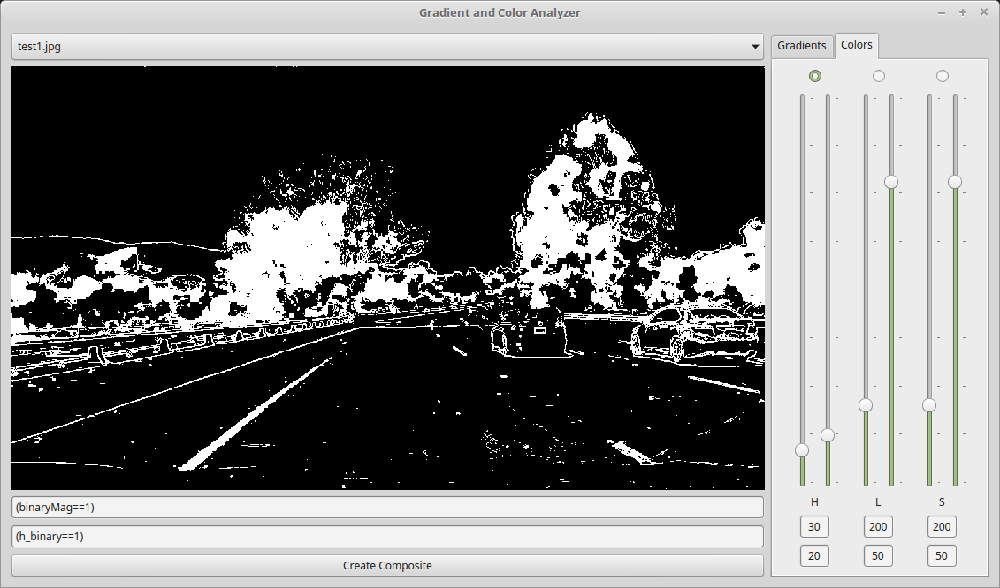

# Advanced Lane Finding Project

#### The goals / steps of this project are the following:

* Compute the camera calibration matrix and distortion coefficients given a set of chessboard images.
* Apply a distortion correction to raw images.
* Use color transforms, gradients, etc., to create a thresholded binary image.
* Apply a perspective transform to rectify binary image ("birds-eye view").
* Detect lane pixels and fit to find the lane boundary.
* Determine the curvature of the lane and vehicle position with respect to center.
* Warp the detected lane boundaries back onto the original image.
* Output visual display of the lane boundaries and numerical estimation of lane curvature and vehicle position.


---
## Camera Calibration

#### 1. Briefly state how you computed the camera matrix and distortion coefficients. Provide an example of a distortion corrected calibration image.

I start by preparing "object points", which will be the (x, y, z) coordinates of the chessboard corners in the world. Assuming the chessboard is fixed on the (x, y) plane at z=0, such that the object points are the same for each calibration image.  Thus, `objp` is just a replicated array of coordinates, and `objpoints` will be appended with a copy of it every time I successfully detect all chessboard corners in a test image.  `imgpoints` will be appended with the (x, y) pixel position of each of the corners in the image plane with each successful chessboard detection.  

I then used the output `objpoints` and `imgpoints` to compute the camera calibration and distortion coefficients using the `cv2.calibrateCamera()` function.  I applied this distortion correction to the test image using the `cv2.undistort()` function and obtained this result:


The whole code for the camera calibration is contained in the module `calibration.py`.  In order to simplify the code of my project, I have chosen not to integrate this code into `main.py`, but to calculate the distortion coefficients first and paste the result manually into lines 24 to 28 in the main module `main.py`.

The distortion coefficients will be saved as numpy-arrays and are given as follows:

```
mtx =  np.array([ [ 878.36220519,    0.,          641.10477419],
                  [   0.,          850.22573416,  237.43088632],
                  [   0.,            0.,            1.        ]])

dist = np.array([ [-0.24236876,  0.29461093,  0.01910478,  0.00032653, -0.21494586] ])
```


## Pipeline (single images)
#### 1. Provide an example of a distortion-corrected image.
To demonstrate the distortion correction, I have applied the function `undistort()` with the parameters `mtx` and `dist` as they were calculated in the module `calibration.py` to the test image `straight_lines2.jpg`.

The image correction is the second operation of the pipeline in line 35 of `main.py` (right after the conversion RGB->BGR).  Let img_bgr be the imput image with BGR color channels.  Then the undistorted image is returned by the function

```
cv2.undistort(img_bgr, mtx, dist, None, mtx)
```

[Of course, one may also use cv2 instead of mpimg to import images (the former already imports them with BGR-channels).  However, the video images are obviously imported with RGB-channels by moviepy, so the conversion RGB->BGR remains in the code pipeline.]


And using the image `test2.jpg`:


As a step of preprocessing, I have applied this perspective-correction function to all the test images available.


#### 2. Describe how (and identify where in your code) you used color transforms, gradients or other methods to create a thresholded binary image.  Provide an example of a binary image result.

The calculations of gradients and color transformations are performed in the modules  `gradients.py` and `hls.py`.  These are imported into the main module, `main.py`.  The pipeline in `main.py` can be configured to use all sorts of logical combinations of binary images if gradients and color channels.  In order to figure out appropriate combinations of these channels, I have developed a little helper tool with a GUI which utilizes PyQt4, `sliderAnalyzer.py`:


Using the sliders ("range sliders" with two handles are by default not contained in Qt), one can play around with the thresholds for gradients and color channels.  The text boxes below the image window allow the user to edit logical combinations of the channels.

Identifying the yellow left lane line between seconds 22 and 27 in the project video was one of the trickiest parts.  I chose HLS as color space, and ended up using only the H-channel of all three color channels.  As thresholds, I chose (20,30).  I experienced that the images were surprisingly sensitive with respect to the lower threshold.  I.e. changing the lower threshold from 20 to 25 already made the left lane line disappear.

Using color and gradient thresholds (lines 38 to 55), I was able to generate a sufficiently clear image:



To summerize, I ended up with
```
  binaryComposite[(H_channel==1) | (gradMag==1)] = 1,
```
although the h-channel was of uttermost importance in this scenario.


#### 3. Describe how (and identify where in your code) you performed a perspective transform and provide an example of a transformed image.

The perspective transformations are done in the module `warper.py` by the functions `imageWarper()` and `imageWarperInv()`.  The former function transforms the trapezoid with the corners `src` onto a rectagle with corners `dst`, i.e. warpes the lane into a bird's eye view:

```
src = np.float32([[675,445], [1020,665], [280,665], [605,445]])
dst = np.float32([[1020,0], [1020,665], [280,665], [280,0]])
```
Or in tabular form:

| Source        | Destination       |
|:--------------:|:--------------------:|
| (675,445)     | (1020,0)       	 |
| (1020,665)   | (1020,665)      	 |
| (280,665)     | (280,665)      	 |
| (605,445)     | (280,0)			 |

I verified that my perspective transform was working as expected by drawing the `src` and `dst` points onto a test image and its warped counterpart to verify that the lines appear parallel in the warped image.


#### 4. Describe how (and identify where in your code) you identified lane-line pixels and fit their positions with a polynomial?

fit my lane lines with a 2nd order polynomial kinda like this:


A second order polynomial is given by

$p(y) = a_2 x^2 + a_1 x + a_0$.

The coefficients are stored for a few frames in a deque and I then take a simple average (see discussion below):

$\overline{p}(y) = \overline{a}_2 x^2 + \overline{a}_1 x + \overline{a}_0$,

where

$\overline{a}_i = \frac{1}{N}\sum_{j=1}^N a_{i,j}, \quad i=0,1,2$.


#### 5. Describe how (and identify where in your code) you calculated the radius of curvature of the lane and the position of the vehicle with respect to center.

I did this in lines # through # in my code in `my_other_file.py`

#### 6. Provide an example image of your result plotted back down onto the road such that the lane area is identified clearly.


The function `screenWriter()` enables one to display text onto the image.


---

## Pipeline (video)

#### 1. Provide a link to your final video output.  Your pipeline should perform reasonably well on the entire project video (wobbly lines are ok but no catastrophic failures that would cause the car to drive off the road!).

Here's a [link to my video result](./output_video/llines.mp4).

---

## Discussion

#### 1. Briefly discuss any problems / issues you faced in your implementation of this project.  Where will your pipeline likely fail?  What could you do to make it more robust?

Here I'll talk about the approach I took, what techniques I used, what worked and why, where the pipeline might fail and how I might improve it if I were going to pursue this project further.  

One of my achievements apart from lane detection itself, is establishing a pipeline structure which enables me to experiment more easily with the parameter values.  This is done by using the 'functions are objects'-paradigm of Python, and an own subroutine for working with

I have followed the advise given at the end of the lectures and implemented stabilization techniques by utilizing the module `deque`:
```
  from collections import deque
```
I let the length of the deque be determined by the variable `BUFFER_LENGTH` and store the three float-type parameters of the polynomial fit.  When the deque is filled up (i.e. after BUFFER_LENGTH frames), I average them and am able to compare the mean with the parameters which were calculated in the most current frame.  A point of discussion when it comes to these sort of problems is choosing the right metric.  I have chosen a very simple approach by comparing the constant coefficients of the polynomial fits, i.e.

$\mid\overline{a}_0-a_0\mid$.

Of course, when aiming for more stable code, I'd aim for an approach which also involves the leading coefficients of the polynomial fit and a more mathematical approach.


In the same manner I have calculated the mean of the position of the vehicle with respect to the left lane line, and the curvature of the road.  As a rule of thumb, deque lengths between 8 and 12 provided good values.
