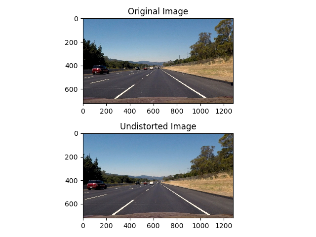
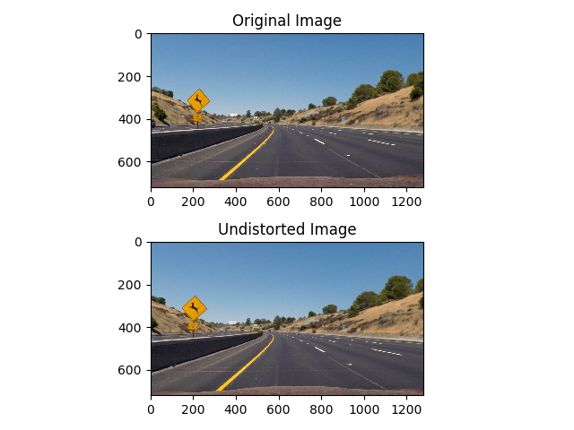
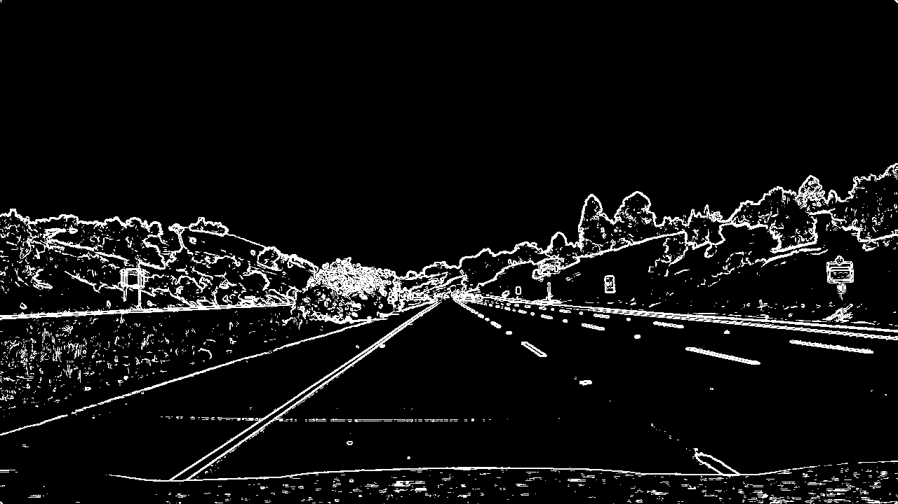
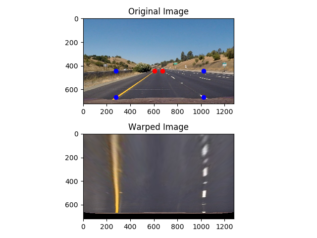
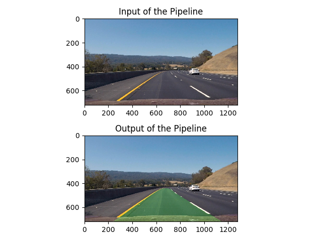

#Advanced Lane Finding Project

####The goals / steps of this project are the following:

* Compute the camera calibration matrix and distortion coefficients given a set of chessboard images.
* Apply a distortion correction to raw images.
* Use color transforms, gradients, etc., to create a thresholded binary image.
* Apply a perspective transform to rectify binary image ("birds-eye view").
* Detect lane pixels and fit to find the lane boundary.
* Determine the curvature of the lane and vehicle position with respect to center.
* Warp the detected lane boundaries back onto the original image.
* Output visual display of the lane boundaries and numerical estimation of lane curvature and vehicle position.


---
##Camera Calibration

####1. Briefly state how you computed the camera matrix and distortion coefficients. Provide an example of a distortion corrected calibration image.


I start by preparing "object points", which will be the (x, y, z) coordinates of the chessboard corners in the world. Here I am assuming the chessboard is fixed on the (x, y) plane at z=0, such that the object points are the same for each calibration image.  Thus, `objp` is just a replicated array of coordinates, and `objpoints` will be appended with a copy of it every time I successfully detect all chessboard corners in a test image.  `imgpoints` will be appended with the (x, y) pixel position of each of the corners in the image plane with each successful chessboard detection.  

I then used the output `objpoints` and `imgpoints` to compute the camera calibration and distortion coefficients using the `cv2.calibrateCamera()` function.  I applied this distortion correction to the test image using the `cv2.undistort()` function and obtained this result: 


##Pipeline (single images)

####1. Provide an example of a distortion-corrected image.
To demonstrate the distortion correction, I will apply the function
```
cv2.undistort(img, mtx, dist, None, mtx)
```
to the test image `straight_lines2.jpg`:



And using the image `test2.jpg`:



As a step of preprocessing, I have applied this perspective-correctiong function to all the test images available. 


####2. Describe how (and identify where in your code) you used color transforms, gradients or other methods to create a thresholded binary image.  Provide an example of a binary image result.

Using color and gradient thresholds (lines ?? to ??), I was able to generate a sufficiently clear image:




####3. Describe how (and identify where in your code) you performed a perspective transform and provide an example of a transformed image.


```
src = np.float32([[675,445], [1020,665], [280,665], [605,445]])
dst = np.float32([[1020,0], [1020,665], [280,665], [280,0]])
```


| Source        | Destination       | 
|:--------------:|:--------------------:| 
| 675,445     | 1020,0       	 | 
| 1020,665   | 1020,665      	 |
| 280,665     | 280,665      	 |
| 605,445     | 280,0			 |

I verified that my perspective transform was working as expected by drawing the `src` and `dst` points onto a test image and its warped counterpart to verify that the lines appear parallel in the warped image.



####4. Describe how (and identify where in your code) you identified lane-line pixels and fit their positions with a polynomial?

fit my lane lines with a 2nd order polynomial kinda like this:


####5. Describe how (and identify where in your code) you calculated the radius of curvature of the lane and the position of the vehicle with respect to center.

I did this in lines # through # in my code in `my_other_file.py`

####6. Provide an example image of your result plotted back down onto the road such that the lane area is identified clearly.

This is implemented lines # through # in my code in `yet_another_file.py` in the function `map_lane()`.  Here is an example of my result on a test image:
Just by calling the member `pipeline.lane`, I can display the image in the output.

`test3.jpg`:



The function `screenWriter()` enables one to display text onto the image.


---

##Pipeline (video)

####1. Provide a link to your final video output.  Your pipeline should perform reasonably well on the entire project video (wobbly lines are ok but no catastrophic failures that would cause the car to drive off the road!).

Here's a [link to my video result](./project_.mp4)

---

##Discussion

####1. Briefly discuss any problems / issues you faced in your implementation of this project.  Where will your pipeline likely fail?  What could you do to make it more robust?

Here I'll talk about the approach I took, what techniques I used, what worked and why, where the pipeline might fail and how I might improve it if I were going to pursue this project further.  

One of my achievements apart from lane detection itself, is establishing a pipeline structure which enables me to experiment more easily with the parameter values.  This is done by using the 'functions are objects'-paradigm of Python, and an own subroutine for working with 


